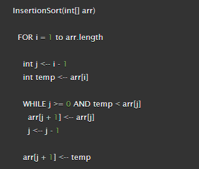

## Insertion Sort

Insertion sort is a sorting algorithm that places an unsorted element at its suitable place in each iteration.

## Pseudocode

## Trace

### Pass 1:

- [8,4,23,42,16,15]-->[4,8,23,42,16,15]
- (min=0 , j=1, temp=4)

### Pass 2:
- [4,8,23,42,16,15]-->[4,8,23,42,16,15]
- (min=1 , j=2, temp=8)

### Pass 3:
- [4,8,23,42,16,15]--> [4,8,15,23,42,16]
- (min=2 , j=3, temp=15)

### Pass 4:
- [4,8,15,23,42,16]--> [4,8,15,16,23,42]
- (min=3 , j=4, temp=16)

### Pass 5:
- [4,8,15,16,23,42]--> [4,8,15,16,23,42]
- (min=4 , j=5, temp=23)

### Pass 6:
- [4,8,15,16,23,42]--> [4,8,15,16,23,42]
- (min=5 , j=6, temp=42)
