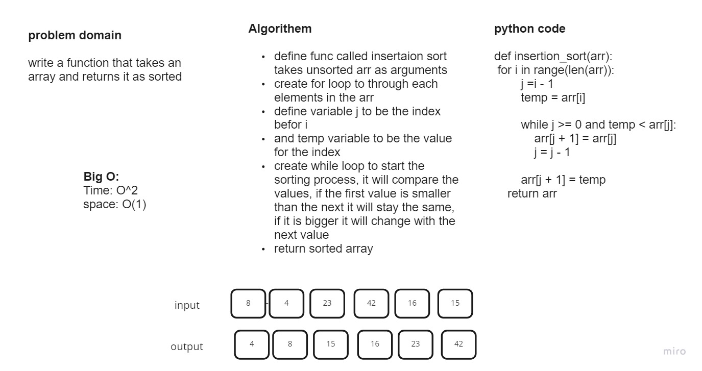

# Challenge Summary
write a function that takes an unsorted array and returns it as stored

## Whiteboard Process

## Approach & Efficiency
Insertion Sort:
Time: O(n^2) Space: O(1)
## Solution
the solution was a function hat takes un sorted array, loop through it to comparre each value in it, to sorted it and return sorted array.