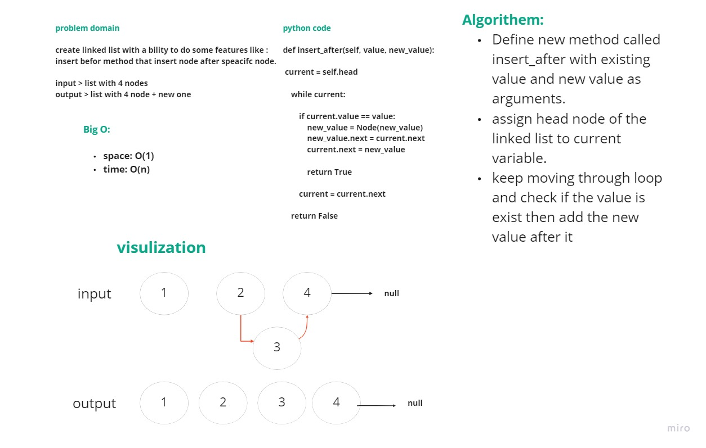

# Singly Linked List
The most important data structure in the world!

## Whiteboard Process
<!-- Embedded whiteboard image -->

## Approach & Efficiency
The Big O for each method used:

- append: O(1)
- insert after: O(1) 
- insert before: O(1)

## Solution
- Append method : takes any value as an argument and adds a new node with that value to the end of the list.

- Insert_before method : Add a new node with the given value  before the first value node.

- Insert_after method :  Add a new node with the given value  after the first value node.