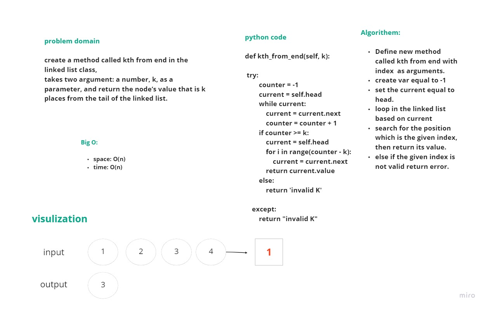

# Singly Linked List
The most important data structure in the world!

## Whiteboard Process
<!-- Embedded whiteboard image -->

    

## Approach & Efficiency
The Big O for the used method:

- kth_from_end: O(n)
  

## Solution

I created a method called kth from end in the linked list class, 
takes two  argument: a number, k, as a parameter, and return the node’s value that is k places from the tail of the linked list.
