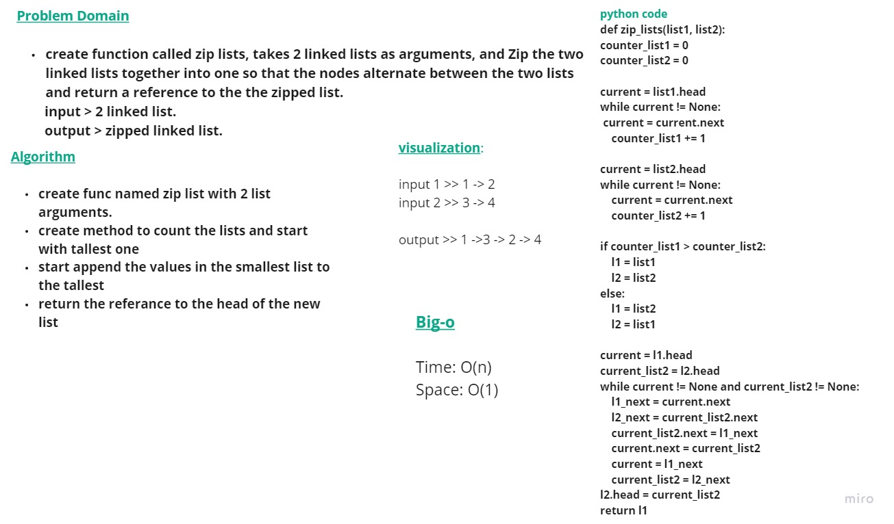

# Singly Linked List
The most important data structure in the world!

## Whiteboard Process
<!-- Embedded whiteboard image -->

## Approach & Efficiency
The Big O for the used method:

- Big O (space): O(1)
- Big O (time): O(n)

## Solution

I created a method called zip lists and used the features that created in linked list class, 
The method takes two  argument: linked list 1, linked list2, and return the merged or zipped linked list.
