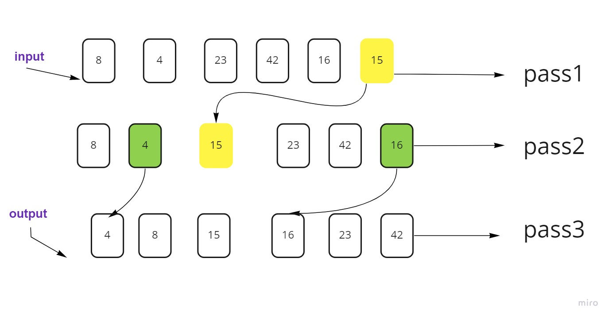

## Quick Sort

QuickSort is a Divide and Conquer algorithm. It picks an element as a pivot and partitions the given array around the picked pivot.

## Trace
Sample Array: [8,4,23,42,16,15]

Pass 1:
- select pivot   --> (15)

Pass 2:
- Divide the array to left (less than pivot), right(bigger than pivot

Pass 3:

- selcte pivot for each subarray (4, 16) and rearrange the array depending on the new pivots

