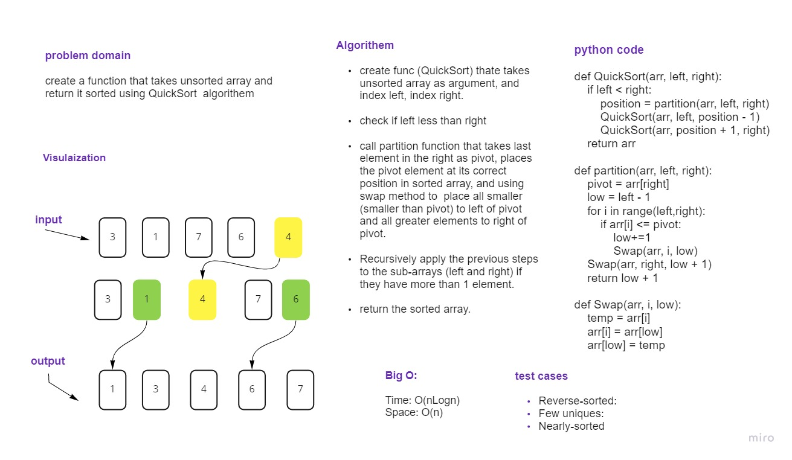

# Challenge Summary
write a (Quick-Sort)function that takes an unsorted array and returns it as stored

## Whiteboard Process

## Approach & Efficiency
Quick Sort:
Time: O(nLogn)

Space: O(n)
## Solution
Specify the pivot (last value in the right), partition the array,and swap values depending if it less or bigger than pivot,
continue thorugh the array until each value is sorted.