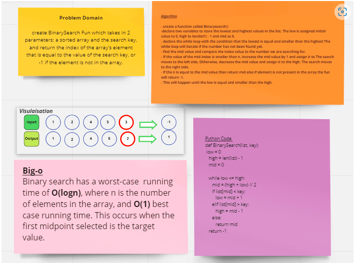

## Array-binary-search Challenge
Binary search looks through an array to see if a desired element is in the array and return its index, else if it does not exist return (-1).

### Whiteboard

 

### Approach & Efficiency
The implementation for the func was through these steps:

- create a function called Binarysearch()

- declare two variables to store the lowest and highest values in the list. The low is assigned initial value to 0, high to len(list1) - 1 and mid as 0.

- declare the while loop with the condition that the lowest is equal and smaller than the highest The while loop will iterate if the number has not been found yet.

- find the mid value and compare the index value to the number we are searching for.

- If the value of the mid-index is smaller than n, increase the mid value by 1 and assign it to The search moves to the left side, Otherwise, decrease the mid value and assign it to the high. The search moves to the right side.

- If the n is equal to the mid value then return mid else if element is not present in the array the fun will return -1.

- This will happen until the low is equal and smaller than the high.

Big O --> O(log n)