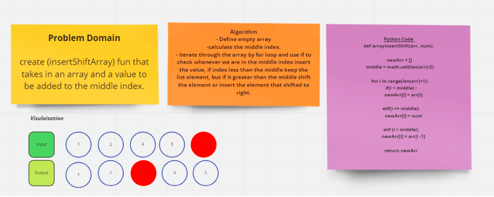

## Array-insert-shift Challenge
Array-insert-shift function takes in an array and a value to be added, and return an array with the new value added at the middle index.

### Whiteboard

 

### Approach & Efficiency
The implementation for the func was through these steps:

- created function wich takes a list and element to be inserted in the middle

- Define empty array

- calculate the middle index.

- iterate through the array by for loop and use if to check whenever we are in the middle index insert the value, if index less than the middle keep the list element, but if is greater than the middle shift the clement or insert the element that shifted to right.

>> Big O --> O(N)