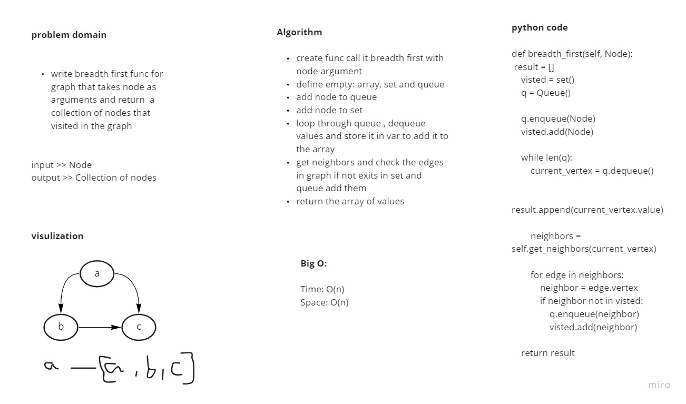

# Graphs
A Graph is a non-linear data structure consisting of nodes and edges. The nodes are sometimes also referred to as vertices and the edges are lines or arcs that connect any two nodes in the graph
## Challenge

## Approach & Efficiency

 efficiency for breadth first:

Big O >> O(n) for space and time
## API
Methods that include in graph class:

- AddNode() Adds a new node to the graph Takes in the value of that node Returns the added node
- AddEdge() Adds a new edge between two nodes in the graph Include the ability to have a “weight” Takes in the two nodes to be connected by the edge Both nodes should already be in the Graph
- GetNodes() Returns all of the nodes in the graph as a collection (set, list, or similar)
- GetNeighbors() Returns a collection of edges connected to the given node Takes in a given node Include the weight of the connection in the returned collection
- Size() Returns the total number of nodes in the graph
- breadth first ()  takes node as arguments and return  a collection of nodes that visited in the graph