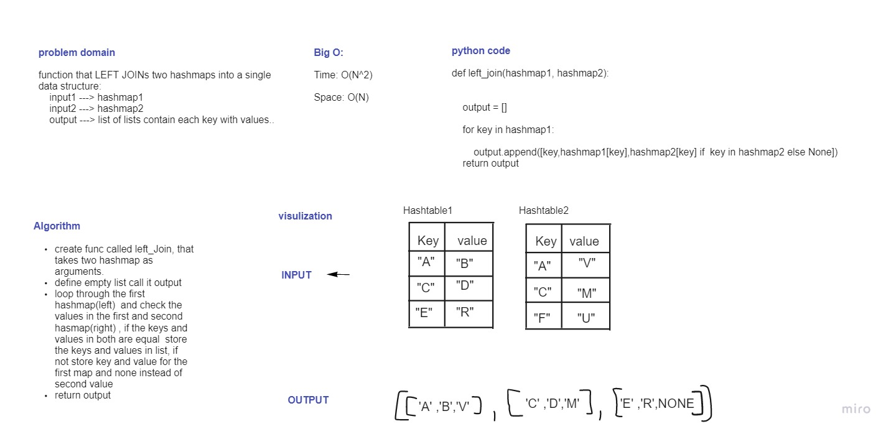

# Challenge Summary

function that takes two hashmaps as arguments, and LEFT JOINs this two hashmaps into a single data structureArguments

## Whiteboard Process

## Approach & Efficiency

I iterate through left hashmap, and check the keys anf values with the right hashmap to join it in new list 

Big (O):

Time: O(N^2)

Space: O(N)

## Solution

Depending on for loop and if statement, I joint two hashmap, by add the similar values to the same key to empty list, and if no values exist in the right hashmap,it will return None.