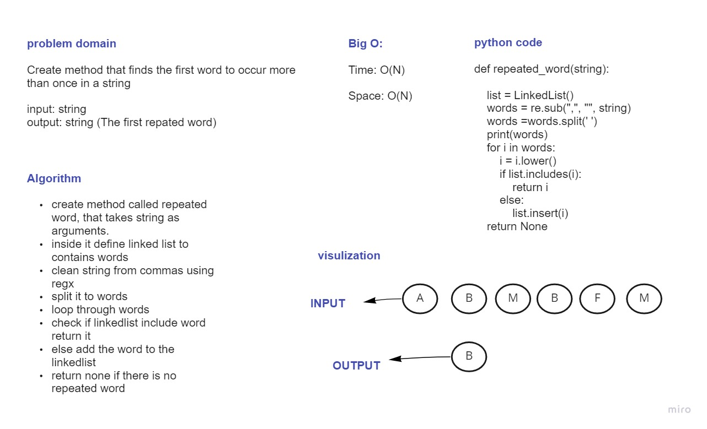

# Challenge Summary
 Create function called repeated word that finds the first word to occur more than once in a string
## Whiteboard Process

## Approach & Efficiency
I used linkedlist to search through strings and 
return the first repeated word.

Time: O(N)

Space: O(N)
## Solution
By giving the method strings that have repeated words, the method will clean the string and split it to words then insert it to the linked list to find the first rpeated word and return it. if there is no repeated word it will return none