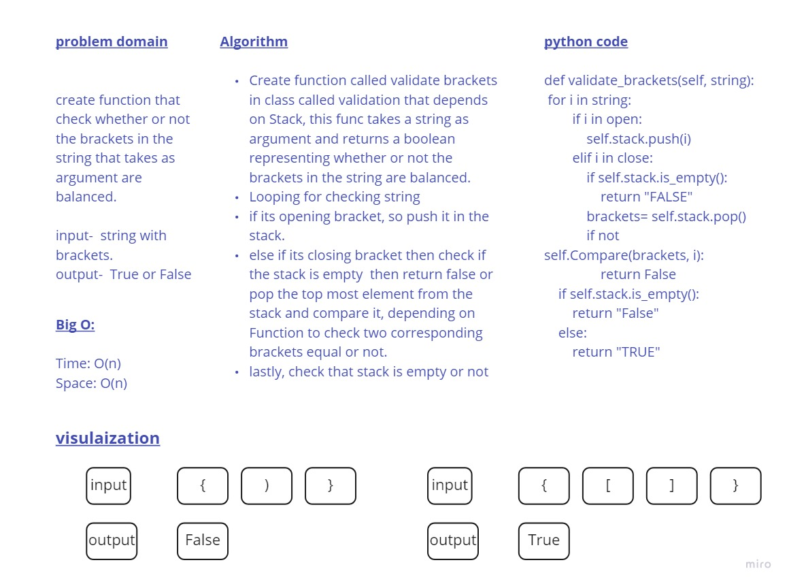

# Challenge Summary
function that check whether or not the brackets in the string that takes as argument are balanced.
## Whiteboard Process

## Approach & Efficiency
Depending on stack data strucure, I built a class with validate brackets method, 
the efficiency for this approch:

Big O:

Time: O(n)  
Space: O(n)

## Solution
I Create function called validate brackets in class called validation that depends on Stack, this func takes a string as argument and returns a boolean representing whether or not the brackets in the string are balanced.