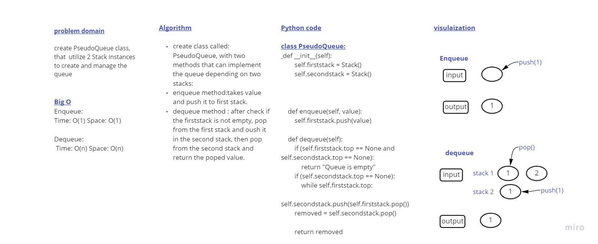

# Challenge Summary
stack-queue-pseudo 

Queue class that has the functions of both enqueue and dequeue while only relying on stacks.

## Whiteboard Process

## Approach & Efficiency

Enqueue: Time: O(1) Space: O(1)
Dequeue: Time: O(n) Space: O(n)

## Solution
create class called: PseudoQueue, with two methods (Enqueue and Dequeue) that can implement depending on two stacks