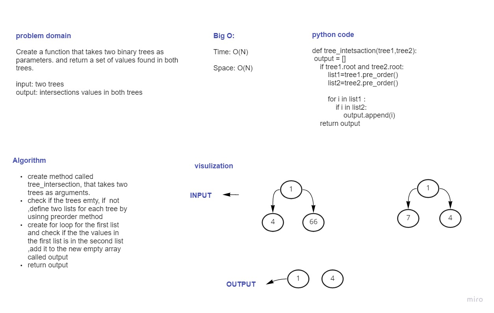

# Challenge Summary
Create a function that takes two binary trees as parameters. and return a set of values found in both trees.
## Whiteboard Process

## Approach & Efficiency
Time: O(n)
Space :O(n)
## Solution
returning the tree intersection values, by using preorder approach to convert trees to lists, then compare them to find common values.