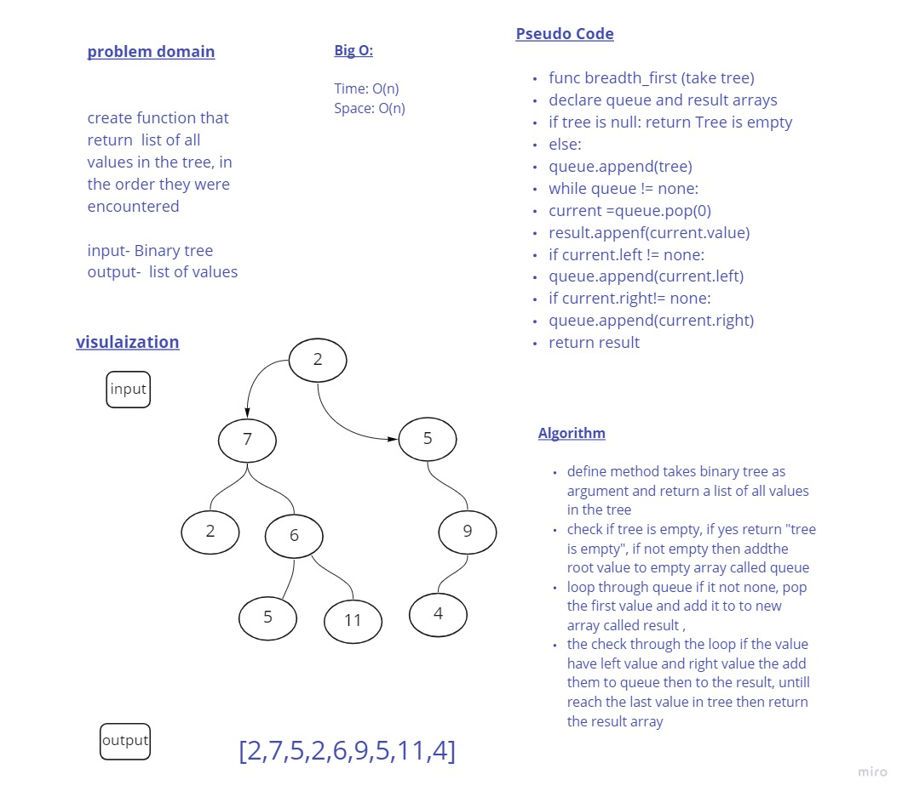

# Challenge Summary
breadth-first method takes binary tree as argument and return a list of all values in the tree, in the order they were encountered

## Whiteboard Process

## Approach & Efficiency
I used iterative approach because of its efficiency that represents in Big O:
- Time : O(n)
- space : o(n)

## Solution
I defined method takes binary tree as argument and return a list of all values in the tree

check if tree is empty, if yes return "tree is empty", if not empty then add the root value to empty array called queue

and then loop through queue if it is not none, pop the first value and add it to new array called result 

then check through the loop if the value have left value and right value the add them to queue then to the result, until reach the last value in tree then return the result array