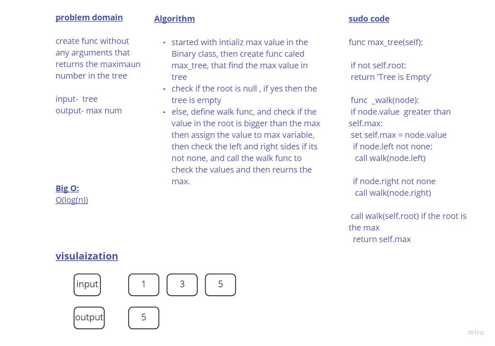

# Challenge Summary
create func without any arguments that  returns the maximaun number in the tree
## Whiteboard Process

## Approach & Efficiency
I used recursion to check the tree values and return the maxuimum value.

- Big O : O(log(n))

## Solution
Inside Binary tree class I create func that find the max value stored in the tree, depending on the recursion